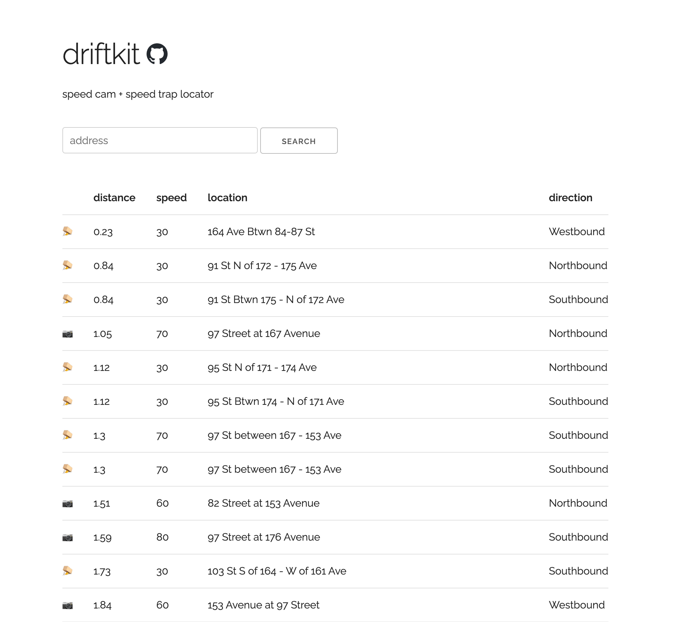

<h1 style="font-family:monospace">driftkit</h1>
<div style="padding-bottom:20px">
    
    
    
    
</div>

edmonton's speed camera + speed trap locator

https://data.edmonton.ca


## Getting Started

### Installation
Download the project, create a virtual environment, and install the required dependencies
```
git clone https://github.com/ttamre/driftkit.git
cd driftkit

python3 -m venv venv
. venv/bin/activate

pip install -r requirements.txt
```

### Usage

### Webserver
```
. venv/bin/activate
gunicorn app:app
```


### Command line interface
```
. venv/bin/activate   # if not already active
python3 api/cli.py
```

```
----------------------------------------------------------------------
 _____  _____  _____ ______ _______ _  _______ _______ 
|  __ \|  __ \|_   _|  ____|__   __| |/ /_   _|__   __|
| |  | | |__) | | | | |__     | |  | ' /  | |    | |   
| |  | |  _  /  | | |  __|    | |  |  <   | |    | |   
| |__| | | \ \ _| |_| |       | |  | . \ _| |_   | |   
|_____/|_|  \_\_____|_|       |_|  |_|\_\_____|  |_|   
 
----------------------------------------------------------------------
Location >               # Enter your current address (or any address)
----------------------------------------------------------------------
```

```
Max radius (0 for no limit) >           # Enter a max radius to search
```


The program will print the camera data

```
Options: refresh, lite, traps, quit
>
```
Enter one of the three options

```r``` or ```refresh``` will ask you for a new address and max distance and update the distances accordingly

```l``` or ```lite``` will re-run the program with a condensed output

```t``` or ```traps``` will show you speed trap zones near you

```q``` or ```quit``` will exit the program

## License

This project is licensed under the GNU General Public License - see [LICENSE](LICENSE) for more details


